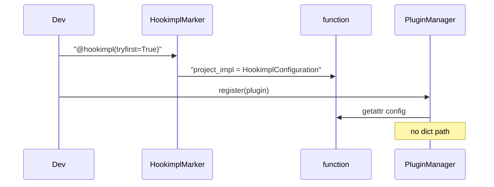

# 03 — Markers attach configuration objects

**Status:** Markers emit new types only
**Depends on:** [02-configuration-objects.md](02-configuration-objects.md)
**Next:** [04-hookimpl-wrapper-types.md](04-hookimpl-wrapper-types.md)
**Also unlocks:** [06-project-spec.md](06-project-spec.md)

## Problem

Markers on `main` attach dicts. After doc 02, configuration classes exist;
markers and discovery must use them exclusively.

## Goals

- `HookspecMarker` / `HookimplMarker` attach `HookspecConfiguration` /
  `HookimplConfiguration` as `<project>_spec` / `<project>_impl`.
- `HookSpec` stores `config: HookspecConfiguration`.
- Manager parsing reads configuration objects only (no dict branch except
  calling the pytest mapping shim if an explicit compat path is required).

## Non-goals

- ProjectSpec on markers (doc 06) — optional to combine.
- Impl subclass factory (doc 04).

## Target design

```python
def setattr_hookspec_opts(func: _F) -> _F:
    config = HookspecConfiguration(
        firstresult=firstresult,
        historic=historic,
        warn_on_impl=warn_on_impl,
        warn_on_impl_args=warn_on_impl_args,
    )
    setattr(func, self.project_name + "_spec", config)
    return func


def setattr_hookimpl_opts(func: _F) -> _F:
    config = HookimplConfiguration(...)
    setattr(func, self.project_name + "_impl", config)
    return func
```

Decorator kwargs unchanged. Attribute **value type** is configuration object.



## Reference branch / files

```bash
git show try-claude:src/pluggy/_hook_markers.py
git show try-claude:src/pluggy/_manager.py
```

## Implementation steps

1. Update markers to construct/attach configuration objects.
2. Update `HookSpec` and manager discovery to use `.firstresult` etc.
3. Remove any `normalize_hookimpl_opts` dict mutation on the live path.
4. Tests: attached attr is configuration instance; historic+firstresult
   raises at decoration time.

```bash
uv run pytest && uv run pre-commit run -a
```

Commit message:

```text
feat(decorators): attach Hook*Configuration objects on marked functions
```

## Public API / back-compat

- Decorator kwargs stable.
- Private attribute payload is now a configuration object (not a dict).
- Callers that poked dict attrs must use the pytest mapping shim or migrate.

## Tests

| File | Coverage |
|------|----------|
| `testing/test_configuration.py` | Attachment + validation |
| Registration / marker tests | Adapt off dict assumptions |

## Done when

- [ ] No marker or manager live path attaches/reads TypedDicts.
- [ ] Suite green.
