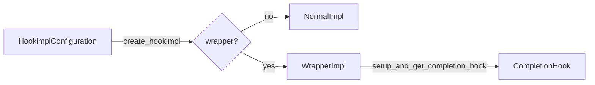

# 04 — HookImpl / WrapperImpl types + CompletionHook setup

**Status:** Core object encoding for implementations
**Depends on:** [03-markers-attach-config.md](03-markers-attach-config.md)
**Next:** [05-hookcaller-and-execution.md](05-hookcaller-and-execution.md)

## Problem

On `main`, one `HookImpl` class carries bool flags (`wrapper`, `hookwrapper`)
copied from a dict. Multicall branches on those flags. try-claude introduced
real subclasses and moved wrapper setup/teardown ownership onto `WrapperImpl`
via **CompletionHook** — that encoding is the point of this series.

## Goals

- `HookImpl` base; `NormalImpl` and `WrapperImpl` subclasses.
- `HookimplConfiguration.create_hookimpl(...) -> NormalImpl | WrapperImpl`
  (**fix try footgun:** normals must be `NormalImpl`, not bare `HookImpl`).
- Store `hookimpl_config: HookimplConfiguration` (not a dict / TypedDict).
- Move arg binding to `HookImpl._get_call_args`.
- Define `@runtime_checkable` `CompletionHook` Protocol.
- Implement `WrapperImpl.setup_and_get_completion_hook(...)`.

## Non-goals

- Rewiring `_multicall` / callers to dual lists (doc 05) — but this doc should
  leave APIs ready so 05 is mostly wiring.
- Async `maybe_submit` (doc 07).

## Target design

```python
# _implementation.py (from try-claude _hook_callers.py impl section)

@runtime_checkable
class CompletionHook(Protocol):
    def __call__(
        self,
        result: object | list[object] | None,
        exception: BaseException | None,
    ) -> tuple[object | list[object] | None, BaseException | None]: ...

class HookImpl:
    function: Final[...]
    argnames: Final[tuple[str, ...]]
    hookimpl_config: Final[HookimplConfiguration]  # not opts dict
    # convenience Final bools mirrored from config OK for attribute compat
    def _get_call_args(self, caller_kwargs: Mapping[str, object]) -> list[object]: ...

class NormalImpl(HookImpl):
    def __init__(..., hook_impl_config: HookimplConfiguration):
        if hook_impl_config.wrapper or hook_impl_config.hookwrapper:
            raise ValueError("use WrapperImpl")
        super().__init__(...)

class WrapperImpl(HookImpl):
    def __init__(..., hook_impl_config: HookimplConfiguration):
        if not (hook_impl_config.wrapper or hook_impl_config.hookwrapper):
            raise ValueError("use NormalImpl / HookImpl for normals")
        super().__init__(...)

    def setup_and_get_completion_hook(
        self, hook_name: str, caller_kwargs: Mapping[str, object]
    ) -> CompletionHook:
        args = self._get_call_args(caller_kwargs)
        if self.hookwrapper:
            wrapper_gen = run_old_style_hookwrapper(self, hook_name, args)
        else:
            wrapper_gen = self.function(*args)
        next(wrapper_gen)  # setup; raise wrapfail if no yield

        def completion_hook(result, exception):
            # send/throw; map StopIteration.value; see try-claude body
            ...
            return new_result, new_exception

        return completion_hook
```

Factory on config:

```python
# _config.py
def create_hookimpl(self, plugin, plugin_name, function) -> NormalImpl | WrapperImpl:
    if self.wrapper or self.hookwrapper:
        return WrapperImpl(plugin, plugin_name, function, self)
    return NormalImpl(plugin, plugin_name, function, self)  # NOT HookImpl
```



## Reference branch / files

```bash
git show try-claude:src/pluggy/_hook_callers.py   # HookImpl, NormalImpl, WrapperImpl, CompletionHook
git show try-claude:src/pluggy/_hook_config.py    # create_hookimpl — fix return type
git show try-claude:src/pluggy/_callers.py        # run_old_style_hookwrapper
```

**Do not** use reiterate’s unused subclasses.

## Implementation steps

### Step 4.1 — Types + factory

1. Add `NormalImpl` / `WrapperImpl` / `CompletionHook` Protocol.
2. Switch `HookImpl` to hold `HookimplConfiguration`.
3. Add `_get_call_args`.
4. Implement `create_hookimpl` returning **`NormalImpl | WrapperImpl`**.
5. Point registration at `create_hookimpl`.

### Step 4.2 — CompletionHook setup on WrapperImpl

Port `setup_and_get_completion_hook` from try-claude carefully (StopIteration /
RuntimeError edge cases around `#544`).

### Step 4.3 — Interim multicall

Until doc 05, multicall may still accept a combined list but should start
calling `setup_and_get_completion_hook` for wrappers if feasible; otherwise
keep flag path one commit and flip fully in 05. Prefer **landing CompletionHook
multicall together with caller split in 05** if interim is messy — then this
step only adds types + factory + method, with unit tests for setup/teardown
in isolation.

### Step 4.4 — Tests

- Factory returns correct subclass.
- Wrong config on NormalImpl/WrapperImpl raises.
- `_get_call_args` missing arg → `HookCallError`.
- Wrapper setup “did not yield” / completion replaces result/exception
  (can be fuller in 05).

```bash
uv run pytest && uv run pre-commit run -a
```

Commit message:

```text
feat(implementation): add NormalImpl, WrapperImpl, and CompletionHook setup API
```

## Public API / back-compat

- `HookImpl` remains importable; subclasses are additive.
- Prefer exporting `HookImpl` (and optionally subclasses) from `pluggy`.
- `CompletionHook` may stay internal or be exported — try kept it near
  callers; exporting is fine if useful for typing.

## Tests

| File | Coverage |
|------|----------|
| New or `testing/test_hookcaller.py` | Factory + subclass invariants |
| Multicall tests | Updated in doc 05 |

## Done when

- [ ] `create_hookimpl` never returns bare `HookImpl` for normals.
- [ ] `WrapperImpl.setup_and_get_completion_hook` exists and matches try semantics.
- [ ] `CompletionHook` is a `@runtime_checkable` Protocol.
- [ ] Suite green.
