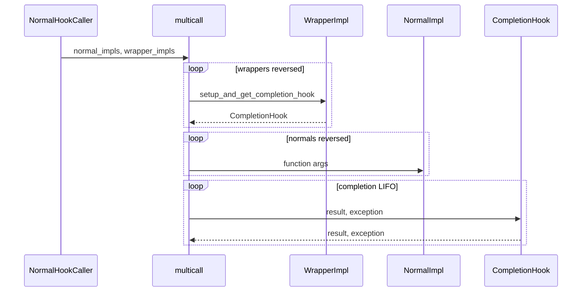

# 05 — Protocol callers + CompletionHook multicall

**Status:** Critical calling / wrapping / tracing redesign
**Depends on:** [04-hookimpl-wrapper-types.md](04-hookimpl-wrapper-types.md)
**Next:** [07-async-submitter.md](07-async-submitter.md) (async wires into this)
**Related:** [06-project-spec.md](06-project-spec.md) may land in parallel

## Problem

On `main`, one `HookCaller` class mixes normal and historic behavior; one
`_hookimpls` list interleaves wrappers; `_multicall` branches on bool flags and
manages generator teardowns inline. Tracing wraps a single-sequence `_hookexec`.

try-claude replaces this with:

- `@runtime_checkable` `HookCaller` Protocol
- `NormalHookCaller` / `HistoricHookCaller` / `SubsetHookCaller`
- Split typed lists
- Dual-sequence `_multicall` driven by **CompletionHook**

This is the critical simplification of the inner hook engine.

## Goals

- Protocol-based caller surface (`isinstance(x, HookCaller)` works).
- Split storage: `_normal_hookimpls: list[NormalImpl]`,
  `_wrapper_hookimpls: list[WrapperImpl]`.
- Historic caller: no wrappers; call history replay unchanged in behavior.
- `_multicall(hook_name, normal_impls, wrapper_impls, caller_kwargs, firstresult, ...)`
  uses CompletionHook LIFO teardown — **no** `.wrapper` flag branching.
- Update `PluginManager._hookexec` / `add_hookcall_monitoring` /
  `enable_tracing` for the new signature (combine lists for before/after
  callbacks if needed for back-compat of monitoring shapes).
- Keep `Result` / `TagTracer` public APIs stable.

## Non-goals

- Async activation details beyond accepting a `Submitter` parameter stub
  (full behavior in doc 07). For this step, either thread a default
  `Submitter()` or add the parameter in 07 — prefer adding the parameter
  here with a no-op-friendly submitter so 07 only activates `run_async`.
- Redesigning monitoring callback *semantics* beyond signature adaptation.

## Target design

### HookCaller Protocol (critical)

```python
@runtime_checkable
class HookCaller(Protocol):
    @property
    def name(self) -> str: ...
    @property
    def spec(self) -> HookSpec | None: ...
    def get_hookimpls(self) -> list[HookImpl]: ...
    def _add_hookimpl(self, hookimpl: HookImpl) -> None: ...

    # call / call_historic / call_extra / etc. as in try-claude
```

Concrete classes (not a fat base with historic flags):

| Class | Role |
|-------|------|
| `NormalHookCaller` | Split lists; `__call__` / `call_extra` |
| `HistoricHookCaller` | `_hookimpls` + `_call_history`; rejects wrappers |
| `SubsetHookCaller` | Filtered view over another caller |

`_insert_hookimpl_into_list` preserves `[trylast, normal, tryfirst]` ordering
per list.

### Multicall (CompletionHook)

```python
def _multicall(
    hook_name: str,
    normal_impls: Sequence[NormalImpl],  # or HookImpl until typed tightened
    wrapper_impls: Sequence[WrapperImpl],
    caller_kwargs: Mapping[str, object],
    firstresult: bool,
    async_submitter: Submitter,  # wire fully in doc 07
) -> object | list[object]:
    completion_hooks: list[CompletionHook] = []
    results: list[object] = []
    exception: BaseException | None = None
    try:
        for wrapper_impl in reversed(wrapper_impls):
            completion_hooks.append(
                wrapper_impl.setup_and_get_completion_hook(hook_name, caller_kwargs)
            )
        for normal_impl in reversed(normal_impls):
            args = normal_impl._get_call_args(caller_kwargs)
            res = normal_impl.function(*args)
            if res is not None:
                # doc 07: maybe_submit if Awaitable
                results.append(res)
                if firstresult:
                    break
    except BaseException as exc:
        exception = exc

    result: object | list[object] | None
    result = (results[0] if results else None) if firstresult else results

    for completion_hook in reversed(completion_hooks):
        result, exception = completion_hook(result, exception)

    if exception is not None:
        raise exception
    return result
```



### Tracing / monitoring

Adapt `add_hookcall_monitoring` traced `_hookexec` to the dual-sequence +
submitter signature. For before/after callbacks that historically received one
list, combine `[*normal_impls, *wrapper_impls]` (try-claude pattern) so
external tracers keep working.

## Reference branch / files

```bash
git show try-claude:src/pluggy/_hook_callers.py
git show try-claude:src/pluggy/_callers.py
git show try-claude:src/pluggy/_manager.py
git show try-claude:testing/test_hookcaller.py
git show try-claude:testing/test_multicall.py
```

**Authority: try-claude only.** Ignore reiterate’s adapter multicall and
class-hierarchy callers.

## Implementation steps

### Step 5.1 — Protocol + concrete callers

1. Introduce `HookCaller` Protocol (`@runtime_checkable`).
2. Implement `NormalHookCaller` / `HistoricHookCaller` / `SubsetHookCaller`.
3. Split lists + `_insert_hookimpl_into_list`.
4. Manager creates the correct caller when adding specs / registering impls.
5. Keep `_HookCaller` alias if needed.

### Step 5.2 — CompletionHook multicall

1. Replace `_execution._multicall` with try-claude CompletionHook version.
2. Remove flag-based wrapper branching from the loop.
3. Wire `_hookexec` signature through manager + callers.

### Step 5.3 — Tracing

1. Update `add_hookcall_monitoring` / `enable_tracing`.
2. Preserve before/after observable behavior via combined list if needed.

### Step 5.4 — Tests

Port/adapt try-claude `test_hookcaller.py` / `test_multicall.py` coverage:

- Ordering across split lists.
- Wrapper teardown order (LIFO).
- Exception propagation through completion hooks.
- Historic rejects wrappers; replay works.
- `isinstance(caller, HookCaller)` is True for concretes.
- Tracing undo / before/after still fire.

```bash
uv run pytest && uv run pre-commit run -a
```

Commit message(s):

```text
refactor(caller): Protocol-based NormalHookCaller and HistoricHookCaller with split impl lists

refactor(execution): CompletionHook-based multicall
```

## Public API / back-compat

- `HookCaller` remains the public name; it is now a Protocol (runtime
  checkable). Document the change for type checkers.
- Export `HistoricHookCaller` (and optionally `NormalHookCaller`) if try did.
- Calling behavior (firstresult, wrappers old/new, historic) unchanged
  observably.
- Monitoring callbacks: keep combined impl list argument shape if that is
  what try-claude preserved.

## Tests

| File | Coverage |
|------|----------|
| `testing/test_hookcaller.py` | Port try-claude additions |
| `testing/test_multicall.py` | CompletionHook semantics |
| Tracing tests | Signature adaptation |

## Done when

- [ ] `HookCaller` is `@runtime_checkable` Protocol; concretes pass isinstance.
- [ ] Dual lists + dual-sequence multicall; CompletionHook LIFO teardown.
- [ ] No wrapper/normal flag branching inside multicall.
- [ ] Historic + tracing behaviors preserved.
- [ ] Suite + pre-commit green.
