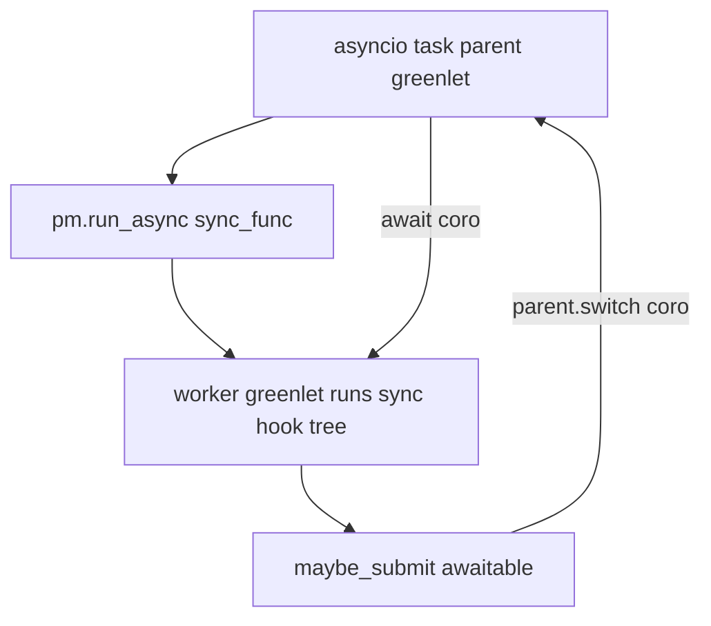

# 07 — Greenlet async Submitter

**Status:** Optional async bridge for awaitable hook results
**Depends on:** [05-hookcaller-and-execution.md](05-hookcaller-and-execution.md)
**Authority:** try-claude only (persistent Submitter — not reiterate monkeypatch)

## Problem

Pluggy’s multicall is synchronous. Downstream (e.g. Datasette /
[await-me-maybe](https://simonwillison.net/2020/Sep/2/await-me-maybe/)) wants
hook impls to return awaitables that are awaited when the host runs under an
async context, without rewriting the entire plugin engine as async.

## Goals

- Add `src/pluggy/_async.py`: `Submitter`, `maybe_submit`, `require_await`,
  `run`, `async_generator_to_sync`.
- Persistent `Submitter` on `PluginManager`, threaded through `_hookexec` /
  callers into `_multicall` (already parameterized in doc 05).
- After each **normal** impl call, if result is `Awaitable`,
  `async_submitter.maybe_submit(res)`.
- `await pm.run_async(lambda: pm.hook.some_hook())` activates the greenlet
  bridge via `Submitter.run`.
- Optional packaging: `pluggy[async] = ["greenlet"]`; testing deps include
  greenlet.
- Fix try-claude footgun: `Submitter.run` must allow legitimate `None`
  returns (use a sentinel).

## Non-goals

- Auto-await of async wrapper generators (document
  `async_generator_to_sync` as a manual helper).
- Nested `run_async` (hard-fail: Submitter already active).
- Making `Submitter` a public `__all__` export unless explicitly desired
  (try kept it private — keep private).

## Target design



### Submitter

```python
class Submitter:
    def maybe_submit(self, coro: Awaitable[_T]) -> _T | Awaitable[_T]:
        """Await if active; else return awaitable unchanged (await-me-maybe)."""

    def require_await(self, coro: Awaitable[_T]) -> _T:
        """Await if active; else RuntimeError."""

    async def run(self, sync_func: Callable[[], _T]) -> _T:
        """Require greenlet; run sync_func in worker greenlet; await switched coros."""
```

### PluginManager

```python
def __init__(..., async_submitter: Submitter | None = None):
    self._async_submitter = async_submitter or Submitter()

async def run_async(self, func: Callable[[], _T]) -> _T:
    return await self._async_submitter.run(func)
```

No temporary replacement of `_inner_hookexec` for async — activation is
entirely `Submitter.run` setting `_active_submitter`.

### Multicall integration

```python
res = normal_impl.function(*args)
if res is not None:
    if isinstance(res, Awaitable):
        res = async_submitter.maybe_submit(res)
    results.append(res)
```

## Reference branch / files

```bash
git show try-claude:src/pluggy/_async.py
git show try-claude:src/pluggy/_callers.py          # maybe_submit site
git show try-claude:src/pluggy/_manager.py          # run_async, persistent submitter
git show try-claude:testing/test_async.py
git show try-claude:pyproject.toml                  # optional-dependencies async
```

**Rejected:** `reiterate-claude` ephemeral submitter + `_inner_hookexec` wrap.

## Implementation steps

### Step 7.1 — `_async.py`

1. Port from try-claude.
2. Fix `None` result footgun with a sentinel.
3. Lazy-import greenlet inside `run` / helpers.

### Step 7.2 — Packaging

```toml
[project.optional-dependencies]
async = ["greenlet"]
```

Add `greenlet` (and `types-greenlet` if needed) to the testing dependency group.

### Step 7.3 — Wire Submitter

1. Ensure doc 05’s `_hookexec` / multicall already take `async_submitter`.
2. Store on PM; pass into callers at construction (try-claude).
3. Implement `run_async` without monkeypatching `_inner_hookexec`.

### Step 7.4 — Tests (`testing/test_async.py`)

Port try-claude suite; minimum:

1. Sync-only under `run_async`
2. Mixed sync + `async def` / coroutine-returning hooks
3. Outside context: awaitable left in results (await-me-maybe)
4. Missing greenlet → clear `RuntimeError`
5. `require_await` outside context fails
6. `async_generator_to_sync` basic / send / throw / inactive
7. Nested `run_async` rejected
8. `run_async` returning `None` succeeds (footgun regression test)

```bash
uv run pytest && uv run pre-commit run -a
```

Commit message:

```text
feat(async): greenlet Submitter and PluginManager.run_async
```

## Public API / back-compat

| API | Notes |
|-----|-------|
| `PluginManager.run_async` | New public method |
| `pluggy[async]` | Optional extra |
| Sync `pm.hook.x()` | Unchanged; may contain raw awaitables in results |
| Wrappers | Still sync generators; async wrappers need manual helper |
| `Submitter` | Private module |

## Behavior matrix

| Scenario | Behavior |
|----------|----------|
| Sync hook, sync call | Unchanged |
| Awaitable outside `run_async` | Left as awaitable (`maybe_submit` no-op) |
| Awaitable inside `run_async` | Awaited; value enters results |
| Missing greenlet | `run_async` raises |
| Nested `run_async` | Raises “already active” |

## Done when

- [ ] Persistent Submitter wired; no exec monkeypatch.
- [ ] Optional `[async]` extra declared.
- [ ] try-claude async tests ported + `None` return regression test.
- [ ] Suite + pre-commit green.
