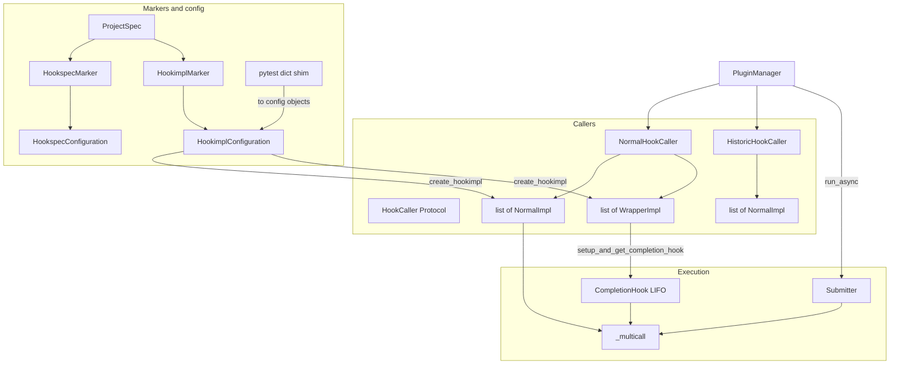

# Pluggy internal refactorings — design docs

Agent-oriented design documents for re-implementing **`try-claude`** onto
`main` as a clean, ordered series of commits.

**`reiterate-claude` was a failed experiment** — do not copy its logic.
These docs are **not** part of the published Sphinx docs.

Read [DECISIONS.md](DECISIONS.md) before implementing anything.

## Goals

- **New types only:** `HookspecConfiguration` / `HookimplConfiguration`;
  TypedDicts removed from the live API (pytest support shim may convert dicts).
- **Typed impls:** `NormalImpl` / `WrapperImpl` + split lists + dual-sequence
  `_multicall`.
- **CompletionHook** (critical): wrappers own setup/teardown; multicall is
  phase orchestration only.
- **Protocols** (critical): `@runtime_checkable` `HookCaller`, `CompletionHook`,
  `_HookExec`, etc.
- **Async:** persistent greenlet `Submitter` + `PluginManager.run_async`.
- Public *behavior* stays compatible; the *encoding* of options upgrades to
  objects.

## Non-goals

- Keeping TypedDicts as a dual long-term API.
- Adopting anything from reiterate’s destroyed abstractions.
- Redesigning `Result` / `TagTracer` public APIs.
- Auto-await of async wrapper generators in v1 async.

## Target architecture

| Area | Choice |
|------|--------|
| Module layout | try-claude split; optional clearer file names (`_config`, `_decorators`, `_caller`, `_implementation`, `_execution`) |
| HookCaller | `@runtime_checkable` Protocol + Normal / Historic / Subset concretes |
| Wrapping | `CompletionHook` via `WrapperImpl.setup_and_get_completion_hook` |
| Options | Configuration classes only; dict shim for pytest support only |
| Impls | `NormalImpl` / `WrapperImpl`; factory returns the right subclass |
| Async | Persistent `Submitter`; `pluggy[async]` |
| Project | `ProjectSpec`; `str \| ProjectSpec` on markers/PM |



## Document index (implement in this order)

| # | Document | Depends on | Summary |
|---|----------|------------|---------|
| 0 | [DECISIONS.md](DECISIONS.md) | — | Authority, Protocols, CompletionHook, TypedDict removal |
| 1 | [01-module-reorganization.md](01-module-reorganization.md) | — | Split into role modules |
| 2 | [02-configuration-objects.md](02-configuration-objects.md) | 01 | Config classes; remove TypedDicts; pytest shim |
| 3 | [03-markers-attach-config.md](03-markers-attach-config.md) | 02 | Markers attach config objects |
| 4 | [04-hookimpl-wrapper-types.md](04-hookimpl-wrapper-types.md) | 03 | NormalImpl / WrapperImpl + CompletionHook setup API |
| 5 | [05-hookcaller-and-execution.md](05-hookcaller-and-execution.md) | 04 | Protocol callers + CompletionHook multicall + tracing |
| 6 | [06-project-spec.md](06-project-spec.md) | 03 | ProjectSpec hub |
| 7 | [07-async-submitter.md](07-async-submitter.md) | 05 | Persistent Submitter + run_async |

## Branch map

| Branch | Role |
|--------|------|
| **`try-claude`** | **Only design authority** |
| `reiterate-claude` | Failed experiment — **do not port** |
| `etablish-claude*` | Out of scope |

```bash
git show try-claude:src/pluggy/_hook_callers.py
git show try-claude:src/pluggy/_callers.py
git show try-claude:src/pluggy/_hook_config.py
git show try-claude:src/pluggy/_async.py
```

## How to assign agents

1. Read [DECISIONS.md](DECISIONS.md).
2. One agent per doc, in order (06 may follow 03).
3. Port from `try-claude`; fix known footguns listed in D8.
4. After every step: `uv run pytest` && `uv run pre-commit run -a`.

## Verification checklist (whole series)

- [ ] No live TypedDict options path; pytest shim isolated if present.
- [ ] `isinstance(caller, HookCaller)` works via runtime_checkable Protocol.
- [ ] Wrappers tear down only through CompletionHook.
- [ ] `create_hookimpl` → `NormalImpl | WrapperImpl`.
- [ ] Dual-sequence multicall; no flag branching for wrapper vs normal.
- [ ] Async: persistent submitter, no exec monkeypatch.
- [ ] `uv run pytest` / `uv run pre-commit run -a` green.
